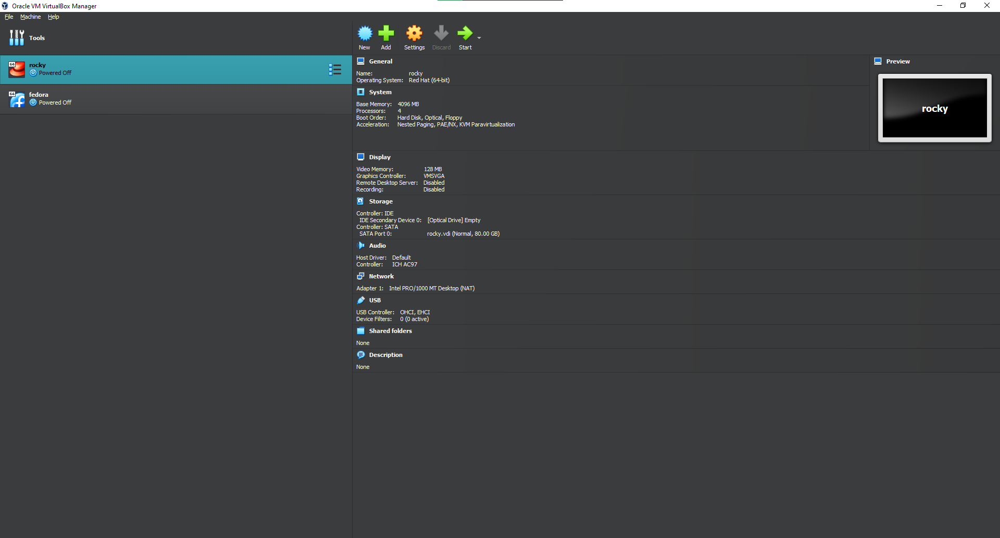

---
## Front matter
title: "ОТЧЕТ О ВЫПОЛНЕНИИ ЛАБОРАТОРНОЙ РАБОТЫ №1"
subtitle: "_дисциплина: Основы информационной безопасности_"
author: "Шилоносов Данил Вячеславович"

## Generic otions
lang: ru-RU
toc-title: "Содержание"

## Bibliography
bibliography: bib/cite.bib
csl: pandoc/csl/gost-r-7-0-5-2008-numeric.csl

## Pdf output format
toc: true # Table of contents
toc-depth: 2
lof: true # List of figures
lot: false # List of tables
fontsize: 12pt
linestretch: 1.5
papersize: a4
documentclass: scrreprt
## I18n polyglossia
polyglossia-lang:
  name: russian
  options:
	- spelling=modern
	- babelshorthands=true
polyglossia-otherlangs:
  name: english
## I18n babel
babel-lang: russian
babel-otherlangs: english
## Fonts
mainfont: PT Serif
romanfont: PT Serif
sansfont: PT Sans
monofont: PT Mono
mainfontoptions: Ligatures=TeX
romanfontoptions: Ligatures=TeX
sansfontoptions: Ligatures=TeX,Scale=MatchLowercase
monofontoptions: Scale=MatchLowercase,Scale=0.9
## Biblatex
biblatex: true
biblio-style: "gost-numeric"
biblatexoptions:
  - parentracker=true
  - backend=biber
  - hyperref=auto
  - language=auto
  - autolang=other*
  - citestyle=gost-numeric
## Pandoc-crossref LaTeX customization
figureTitle: "Рис."
tableTitle: "Таблица"
listingTitle: "Листинг"
lofTitle: "Список иллюстраций"
lotTitle: "Список таблиц"
lolTitle: "Листинги"
## Misc options
indent: true
header-includes:
  - \usepackage{indentfirst}
  - \usepackage{float} # keep figures where there are in the text
  - \floatplacement{figure}{H} # keep figures where there are in the text
---

# Цель работы

Целью данной работы является приобретение практических навыков установки операционной системы на виртуальную машину, настройки минимально необходимых для дальнейшей работы сервисов.

# Выполнение лабораторной работы

В ходе лабораторной работы были предприняты шаги для создания виртуальных машин с операционными системами Rocky Linux и Fedora Linux. Для этого, в первую очередь, было необходимо подготовить виртуальное окружение, в котором и будут развернуты данные операционные системы. Процесс начался с выбора соответствующего программного обеспечения для виртуализации, которое позволяет эмулировать аппаратное обеспечение компьютера и создавать изолированные виртуальные машины.

Далее, были загружены образы операционных систем Rocky Linux и Fedora Linux. Эти образы представляют собой полные копии системы, которые могут быть использованы для установки на виртуальные машины. После загрузки образов, были созданы новые виртуальные машины, для каждой из операционных систем соответственно. В процессе создания виртуальных машин были настроены основные параметры, такие как размер выделяемой оперативной памяти, размер диска и конфигурация сети, чтобы обеспечить оптимальную работу операционных систем в виртуальном окружении.

Создадим виртуальные машины Rocky Linux и Fedora Linux. (рис. [-@fig:001])

{#fig:001 width=70%}

После успешного создания виртуальных машин был выполнен запуск виртуальной машины с Rocky Linux. Этот шаг включал в себя инициализацию виртуальной машины и загрузку операционной системы с ранее подготовленного образа. На экране появилось рабочее окружение Rocky Linux, что указывает на успешное завершение процесса загрузки и готовность системы к дальнейшей настройке и использованию.

Запустим  Rocky. (рис. [-@fig:001])

{#fig:002 width=70%}

В процессе запуска и последующей работы с виртуальной машиной на Rocky Linux были рассмотрены основные аспекты работы операционной системы в виртуальном окружении, такие как доступ к файловой системе, управление процессами и настройка сетевых соединений. Это позволило не только углубить знания о специфике работы с операционными системами в целом, но и получить практические навыки их настройки и эксплуатации в условиях виртуальной среды.

# Выводы

В процессе выполнения данной лабораторной работы были успешно приобретены практические навыки установки операционной системы на виртуальную машину. Этот процесс включал в себя подготовку виртуального окружения, выбор и загрузку подходящего образа операционной системы, а также непосредственно процесс установки. После успешной установки операционной системы, была выполнена настройка минимально необходимых для дальнейшей работы сервисов. Это позволило обеспечить функционирование системы в соответствии с требованиями задания и создать основу для дальнейшего изучения и эксплуатации операционных систем в виртуальной среде.

Дополнительно, в ходе работы были изучены основные инструменты и возможности виртуальной машины, что расширило понимание принципов виртуализации и её применения для создания тестовых и разработческих сред. Полученные навыки и знания будут полезны в дальнейшем обучении и профессиональной деятельности, поскольку виртуализация является ключевым элементом в современных информационных технологиях.

Таким образом, выполнение данной лабораторной работы позволило не только достичь поставленной цели, но и расширило теоретические знания о виртуальных машинах и операционных системах, а также улучшило практические навыки работы с ними.
